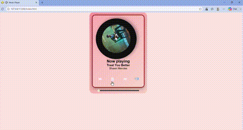

# 🎵 Music Player
---
A browser-based music player built from scratch using **HTML, CSS, and JavaScript** — no frameworks, no libraries.
This project started as a beginner exercise and is being actively improved as I learn more about DOM manipulation, the Web Audio API, and frontend design.

> Built by a 3rd-year Software Engineering student, learning by extending one project instead of starting new ones every week.

---

## 🚀 Features

- ▶️ Play / Pause / Next / Previous controls
- 🎚️ Seekable progress bar synced to audio playback
- 🔊 Toggleable volume slider
- 💿 Spinning vinyl-style disc with album art that updates per song
- 🎨 Clean, custom-styled UI (gradient background, glassmorphism player card)

---

## 🛠️ Tech Stack

- **HTML5** – structure & `<audio>` element
- **CSS3** – styling, animations (`@keyframes`, `animation-play-state`), glassmorphism effects
- **Vanilla JavaScript** – DOM manipulation, event listeners, audio control logic

No frameworks or build tools — deliberately kept vanilla to focus on core web fundamentals first.

---

## 📂 Project Structure
music-player/
├── index.html
├── style.css
├── script.js
├── covers/          # album art per song
│   ├── song1.jpg
│   └── song2.jpg
└── songs/           # audio files
├── song1.mp3
└── song2.mp3
└── screenshot/      # progress screenshot
├── preview.gif

---
## ▶️ Running Locally

1. Clone the repo
```bash
   git clone https://github.com/niyashajain-ai/Music-Player-
```
2. Add your own `.mp3` files to the `songs/` folder and matching cover images to `covers/`
3. Open `index.html` in your browser (or use a tool like VS Code's Live Server extension for best results)

---

## 🧭 Roadmap

This project is a work in progress, being built up in stages:

- [x] Fix core playback bugs (volume control)
- [x] Dynamic album art per song
- [x] CD/vinyl look with center hole and label ring
- [ ] Pause spinning animation when paused
- [ ] Current time / duration display
- [ ] Real song search via iTunes Search API (instead of hardcoded songs)
- [ ] Playlist/queue UI
- [ ] Shuffle & repeat modes
- [ ] Save last-played song & volume via `localStorage`
- [ ] Background color that shifts based on album art
- [ ] Audio-reactive visualizer (Web Audio API)

---

## 📖 What I'm Learning

This project is intentionally being used as a long-term learning tool rather than a one-off build. Each feature is added to practice a specific concept:

- DOM manipulation & event handling
- Working with the native `<audio>` element and its events
- CSS animations controlled via JavaScript
- Fetching and rendering data from a public API
- Browser storage (`localStorage`)
- Canvas & Web Audio APIs

---
## 📸 Preview



---
## 📝 License

This project is for personal learning purposes.

----

